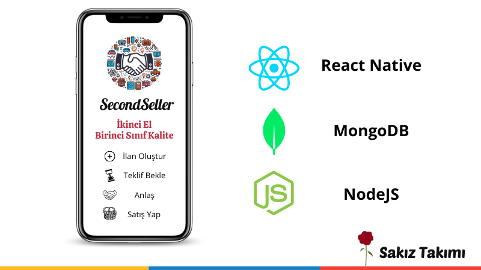
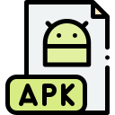

# Second Seller Projesi

**Proje Tanımı**:

**Proje Kategorisi**: İkinci el e-ticaret

**Referans Uygulama**: [Letgo.com](https://www.letgo.com/)

**Uygulama Adresi**:

**Grup Adı**: SAKIZ

**Proje Ekibi**:

- Zekeriya Dönmez
- Alper Avcı
- İsmail Kaya
- Kamil Özdemir
- Selin Aydemir

1. [Proje Planı](https://www.ibb.co/KD4mMqV)
2. [Gereksinim Analizi](/gereksinimler/gereksinim_analizi.md)
3. [Durum Diyagramı]()
4. [Durum Senaryoları]()
5. [Veritabanı Diyagramı]()
6. [Front-End]()
7. [Back-End]()
8. [Test]()
9. [Geliştirici ve Kullanıcı Dökümantasyonları]()

# Planlama Çizelgesi - Ek

* [Çizelge | Trello](https://trello.com/invite/b/ENIJ4ZpO/ATTI01f9e93770f2e1de38fa88ae877f596f9C7B51DD/second-seller-project)

---
 

  

 

# 📜 Uygulama Açıklaması

İkinci el eşya alım ve satımı için React Native ile yazılmış mobil uygulama projesidir.

# ⚡️ Uygulama Özellikleri

* **İlan Yönetimi:**
    *   **İlan Ekleme:** Yeni ilanlar oluşturabilirsiniz.
    *   **İlan Kaldırma:** İstemediğiniz ilanları kolaylıkla kaldırabilirsiniz.
    *   **İlan Güncelleme:** Mevcut ilanlarınızın bilgilerini güncelleyebilirsiniz.
    *   **Satıldı Olarak İşaretleme:** Satılan ürünlerinizin artık başkaları tarafından görüntülenmesini engelleyebiliriniz.

* **Favoriler:**
    *   **Favoriye Alma:** Beğendiğiniz ilanları favoriye ekleyebilirsiniz.
    *   **Favorilerin Listelenmesi:**
    Uygulama içerisinde favorilerinizi listeleyebilirsiniz.
    *   **Favoriden Kaldırma:** Artık ilgilenmediğiniz ilanları favoriden kaldırabilirsiniz.

* **Filtreleme ve Arama:**
    *   **Tarihe Göre Filtreleme:** İlgilendiğiniz ilanları ilan oluşturulma tarihine göre artan/azalan olacak şekilde filtreleyebilirssiniz.
    *   **Fiyata Göre Filtreleme:** İlgilendiğiniz ilanları artan/azalan fiyata göre veya minimum-maksimum fiyat aralığına göre filtreleyebilirsiniz.
    *   **Kategoriye Göre Filtreleme:** İlanları varolan kategorilere göre filtreleyebilirsiniz.
    *   **İlan İsmine Göre Arama:** İlan ismini kullanarak içerisinde geçtiğini düşündüğünüz kelimeler ile filtreleme yapabilirsiniz.

*   **Kullanıcı İşlemleri:**
    * **Kayıt Olma:** Uygulamada kullanacağınız bilgiler ile bir kullanıcı oluşturabilirsiniz.
    * **Giriş Yapma:** Kayıt esnasında belirtilen e-posta adresi ve şifre ile giriş yapabilirsiniz.
    * **Şifremi Unuttum:** Şifrenizi unuttuğunuz zaman uygulamadaki kayıtlı olan e-posta adresi ile şifrenizi sıfırlayabilirsiniz.
    * **Hesap Kapatma:** Uygulamadaki hesabınızın devre dışı bırakılmasını istediğiniz zaman hesabınızı kapatabilirsiniz.
    * **Profil Düzenleme:** Profil bilgilerinizi kolayca güncelleyebilirssiniz.
    * **Çıkış Yapma:** Giriş yaptığınız hesap üzerinden çıkış yapabilirsiniz.

*   **Kullanıcı Etkileşimleri:**
    * **İlan Detay Görüntüleme:** Seçtiğiniz ilanın bütün detaylarını görüntüleyebilirsiniz.
    * **Kullanıcının Diğer İlanlarını Görüntüleme:** Kullanıcının paylaştığı diğer ilanları görüntüleyebilirsiniz.
    * **Sohbet Başlatma:** İlan detayını görüntülediğiniz ilan sahibi ile ilan için sohbet başlatabilirsiniz.
    * **Hızlı Mesajlar:** Hazır mesajları kullanarak sohbet esnasında daha hızlı iletişim kurabilirsiniz.
    * **Fiyat Teklifi Gönderme:** Beğendiğiniz ilanlar için fiyat teklifi gönderebilirsiniz.
    * **Konum Paylaşma:** İlan sohbeti esnasında karşıdaki kişiye konumunuzu paylaşabilirsiniz.
    * **Kişiyi Arama:** İlan sohbeti esnasında karşıdaki kişiyle telefon araması başlatabilirsiniz.
    * **Kişiyi Bloklama:** Sohbet esnasında rahatsız olduğunuz zaman karşıdaki kişiyi bloklayabilir diğer ilanlarınız için sizinle sohbet oluşturmasının önüne geçebilirsiniz.

*   **Kullanıcı Deneyimi:**
    *   **Koyu & Açık Mod:** Uygulamayı kişisel tercihlerinize göre koyu veya açık modda kullanabilirsiniz.
    *   **Bildirim:** Uygulama içerisindeki bildirimleri açabilir veya kapatabilirsiniz.

# 📱 Uygulama Kurulumu

**Uygulama aşağıdaki şartlar altında test edilmiştir.**

- **React Native Versiyon:** 0.73.4
- **NodeJS Versiyon:** 20.9.0
- **İşletim Sistemi:** Android

## İndirme Bağlantıları

    
